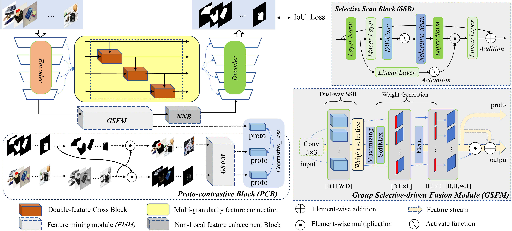
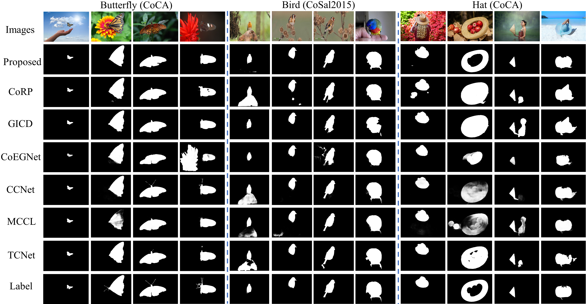
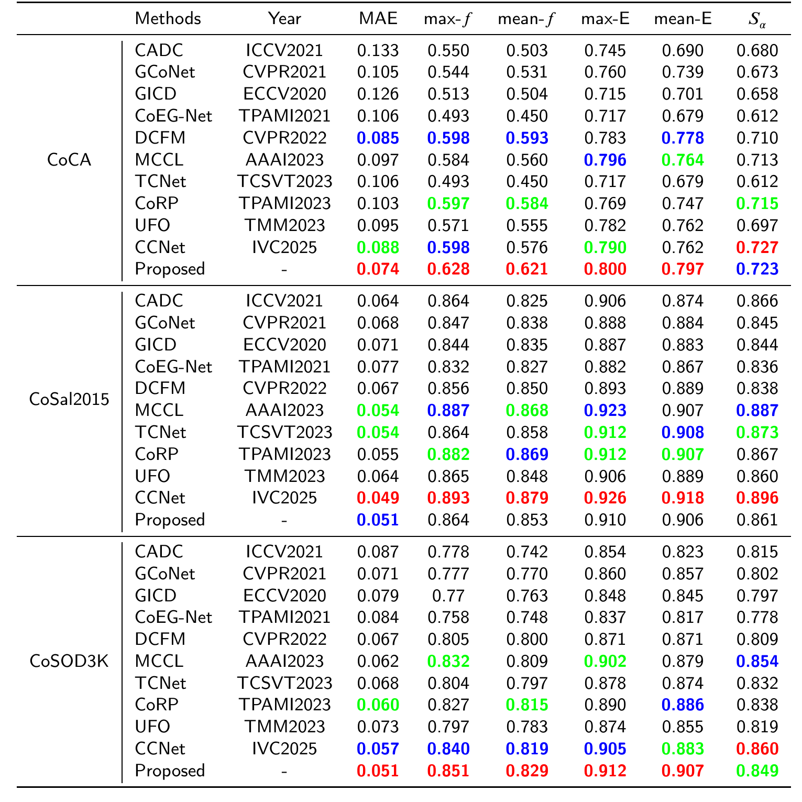

# **PGFusion: Prototype-contrastive Interaction and Group Selective-driven Fusion for Co-salient Object Detection**


## Network Architecture


## Results and Saliency maps
We perform quantitative comparisons and qualitative comparisons with 6 co-SOD
methods on 3 datasets.



### Prerequisites
- Python 3.6
- Pytorch 1.10.2
- Torchvision 0.11.3
- Numpy 1.19.2

  install SSM
   ```
  pip install torch==1.13.0 torchvision==0.14.0 torchaudio==0.13.0 --extra-index-url https://download.pytorch.org/whl/cu117
  pip install packaging
  pip install timm==0.4.12
  pip install pytest chardet yacs termcolor
  pip install submitit tensorboardX
  pip install triton==2.0.0
  pip install causal_conv1d==1.0.0  # causal_conv1d-1.0.0+cu118torch1.13cxx11abiFALSE-cp38-cp38-linux_x86_64.whl
  pip install mamba_ssm==1.0.1  # mmamba_ssm-1.0.1+cu118torch1.13cxx11abiFALSE-cp38-cp38-linux_x86_64.whl
  pip install scikit-learn matplotlib thop h5py SimpleITK scikit-image medpy yacs
   ```

## Benchmark Datasets

- [VT5000 (ArXiv)](https://arxiv.org/pdf/2007.03262.pdf) [Download Datasets (Google Drive)](https://drive.google.com/drive/folders/1So0dHK5-aKj1t6OmFhRGLh_0nsXbldZE?usp=sharing) 
- [VT1000 (ArXiv)](https://arxiv.org/pdf/1905.06741.pdf) [Download Datasets (Google Drive)](https://drive.google.com/drive/folders/1kEGOuljxKxIYwH54sNH_Wqmw7Sf7tTw5?usp=sharing) 

  
 Datasets to `Mainfile/data` as the following structure:
  ```
  RGBT-Code
     ├── other codes
     ├── ...
     │ 
     └── data
           
           ├── VT1000 (CoCo-SEG's image files)
           ├── VT5000 (CoSOD3k's image files)
           ├── NLPR (CoSOD3k's image files)  
           └── NJUK (Cosal2015's image files)
  ```

## Relevant Literature

```text
@misc{ruan2024vmunetvisionmambaunet,
      title={VM-UNet: Vision Mamba UNet for Medical Image Segmentation}, 
      author={Jiacheng Ruan and Jincheng Li and Suncheng Xiang},
      year={2024},
      eprint={2402.02491},
      archivePrefix={arXiv},
      primaryClass={eess.IV},
      url={https://arxiv.org/abs/2402.02491}, 
}

...
```
